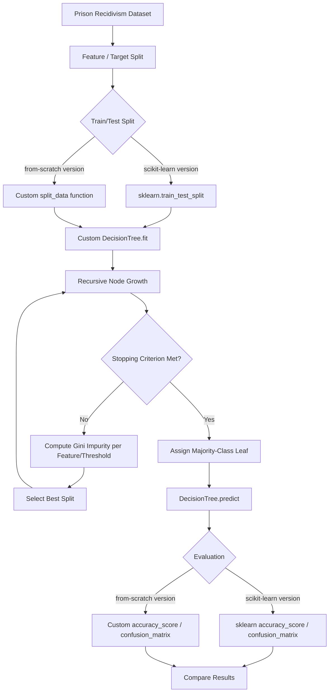

<div align="center">
  
</div>

---

# Recidivism Prediction with Decision Trees: A From-Scratch and Scikit-Learn Comparative Study

This project implements the **CART decision tree algorithm entirely from scratch** — including recursive tree induction, Gini-impurity-based splitting, train/test partitioning, and evaluation metrics — and benchmarks it against a scikit-learn-assisted implementation to predict prisoner recidivism on a real-world criminal justice dataset.

<div align="left">

[](https://www.python.org/)
[](https://numpy.org/)
[](https://pandas.pydata.org/)
[](https://scikit-learn.org/)
[](https://jupyter.org/)
[](#)
[](#)
[](https://opensource.org/licenses/MIT)

</div>

## Abstract

Recidivism prediction — estimating the likelihood that a released offender will return to prison — is a widely studied problem in criminal justice analytics, where model interpretability is as important as predictive accuracy. This project builds a decision tree classifier for recidivism prediction in two parallel ways: a **fully from-scratch implementation** of the CART algorithm (custom train/test splitting, Gini impurity computation, recursive tree growth, and evaluation metrics, with zero dependency on machine learning libraries) and a **library-assisted implementation** that reuses the same custom `DecisionTree` class alongside scikit-learn's data-splitting and evaluation utilities. Both variants are trained and evaluated on a real-world Iowa Department of Corrections recidivism dataset, and their results are directly compared to validate the correctness of the from-scratch implementation.

## Table of Contents

1. [Overview](#overview)
2. [Key Features](#key-features)
3. [Dataset](#dataset)
4. [Algorithm and Workflow](#algorithm-and-workflow)
5. [Implementation Approaches](#implementation-approaches)
6. [Results](#results)
7. [Project Structure](#project-structure)
8. [Installation](#installation)
9. [License](#license)
10. [Author](#author)

## Overview

This project addresses binary recidivism classification — predicting whether a released individual will return to prison — using a **decision tree** built on demographic, offense, and supervision-related features. Rather than relying solely on `scikit-learn`, the core of the project is a hand-built `DecisionTree` class that implements the CART (Classification and Regression Trees) algorithm from first principles: computing Gini impurity, searching for the optimal feature/threshold split at every node, and recursively growing the tree until a stopping criterion is met. This same custom classifier is then evaluated using two different data-handling pipelines — one built with `scikit-learn` utilities, and one built entirely from scratch — to confirm that the results are consistent regardless of the surrounding tooling.

## Key Features

- Fully custom `DecisionTree` and `Node` classes implementing the CART algorithm with Gini-impurity-based optimal splitting
- Recursive, depth-limited tree induction with majority-class leaf assignment
- Human-readable tree structure printout (`print_tree`) for model interpretability
- A **from-scratch** train/test splitting function, accuracy metric, and confusion matrix — with no `scikit-learn` dependency
- A **library-assisted** pipeline using `sklearn.model_selection.train_test_split`, `sklearn.metrics.accuracy_score`, and `sklearn.metrics.confusion_matrix` for cross-validation of the custom tree
- Side-by-side comparison of both pipelines on the same dataset to verify implementation correctness

## Dataset

The project uses a real-world **prison recidivism dataset** (Iowa Department of Corrections), containing **15,424 records** across **11 features**, including:

| Feature | Description |
|:---|:---|
| Fiscal Year Released | Year the individual was released from prison |
| Recidivism Reporting Year | Year in which recidivism status was recorded |
| Race - Ethnicity | Race/ethnicity of the individual |
| Age At Release | Age bracket at the time of release |
| Convicting Offense Classification | Legal classification of the offense (e.g., felony class) |
| Convicting Offense Type | General category of the offense (e.g., Violent, Drug, Property) |
| Convicting Offense Subtype | Finer-grained offense category |
| Main Supervising District | Judicial district responsible for supervision |
| Release Type | Type of release (e.g., Parole, Discharge) |
| Part of Target Population | Whether the individual belongs to a designated target population |
| **Recidivism - Return to Prison numeric** | **Target label** — whether the individual returned to prison (binary) |

## Algorithm and Workflow

Both pipelines follow the same end-to-end workflow, differing only in which components are provided by a library versus implemented manually.



At each internal node, the tree evaluates every candidate feature and threshold, computing the weighted Gini impurity of the resulting left/right partitions:

```
Gini(y) = 1 - Σ p_i²
```

where `p_i` is the proportion of samples belonging to class `i`. The split that minimizes the weighted Gini impurity across both child partitions is selected, and the process repeats recursively until the tree reaches `max_depth` or a node becomes pure (a single class remains).

## Implementation Approaches

| Aspect | With-Library Version | Fully From-Scratch Version |
|:---|:---|:---|
| Train/test split | `sklearn.model_selection.train_test_split` | Custom `split_data` function using `numpy.random.choice` |
| Accuracy metric | `sklearn.metrics.accuracy_score` | Custom `accuracy_score` function |
| Confusion matrix | `sklearn.metrics.confusion_matrix` | Custom `confusion_matrix` function |
| Tree induction | Custom `DecisionTree` (CART, Gini impurity) | Custom `DecisionTree` (CART, Gini impurity) |
| Dependencies | `pandas`, `numpy`, `scikit-learn` | `pandas`, `numpy` only |

## Results

Both implementations were trained with `max_depth=3` on an 80/20 train-test split (`random_state=42`) and produced consistent results, confirming that the from-scratch data-handling utilities behave equivalently to their `scikit-learn` counterparts:

| Version | Accuracy | Test Set Size |
|:---|:---|:---|
| With-Library (scikit-learn splitting/metrics) | ~72.1% | 3,085 |
| Fully From-Scratch | ~72.1% | 3,084 |

> The near-identical accuracy and confusion matrices across both pipelines validate the correctness of the custom `split_data`, `accuracy_score`, and `confusion_matrix` implementations against their well-tested `scikit-learn` equivalents.

## Project Structure

```
Recidivism-Prediction-Decision-Tree/
│
├── Recidivism_Prediction_Decision_Tree.ipynb
├── prison_dataset.csv
├── LICENSE
└── README.md
```

## Installation

Clone the repository and open the notebook in Jupyter or Google Colab:

```bash
git clone https://github.com/ParmidaGh/Recidivism-Prediction-Decision-Tree.git
cd Recidivism-Prediction-Decision-Tree
```

Then open `Recidivism_Prediction_Decision_Tree.ipynb` and run the cells in order. The notebook expects `prison_dataset.csv` to be accessible at the path referenced in the first cell (update the path if running locally instead of Google Colab).

## License

This project is licensed under the MIT License.

## Author

**Parmida Ghamari**
M.Sc. Student, University of Tehran
Research Assistant @ Social Networks Lab

**Research Interests:** Machine Learning, Interpretable AI, Decision Tree Algorithms, Applied Data Mining, Criminal Justice Analytics

📧 [Parmida.ghamari@gmail.com](mailto:Parmida.ghamari@gmail.com) | 💻 [github.com/ParmidaGh](https://github.com/ParmidaGh) | 💼 [www.linkedin.com/in/parmida-ghamari](https://www.linkedin.com/in/parmida-ghamari)

---

<p align="center">
  Built with NumPy, Pandas, and scikit-learn
</p>
